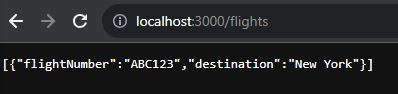
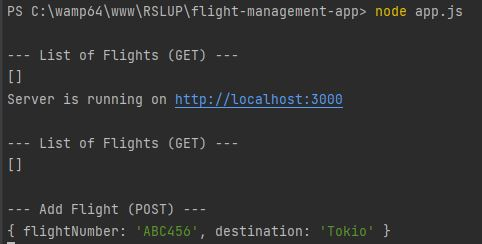

<h1>Flight Management Application</h1>

<p>This is a simple flight management system implemented in Node.js without using Express.js. The application provides a basic HTTP server with RESTful endpoints to manage flights.</p>

<h3>Prerequisites</h3>  
<ul>
<li>Node.js installed on your machine</li>
<li>npm (Node Package Manager)</li>
</ul>

<h3>Usage</h3>
<ol>
    <li>Run the Application</li>
    ```node app.js```
    <li>Open a web browser or use tools like curl, Postman, or a custom Node.js client to interact with the API.
        <ul>
            <li>
                <b>List all flights (GET):</b> <br>
                Endpoint: http://localhost:3000/flights
            </li>
            <li>
                <b>Add a new flight (POST):</b>
                Endpoint: http://localhost:3000/flights
            </li>
        </ul>
</li>

</ol>

<h3>Screenshots</h3>

